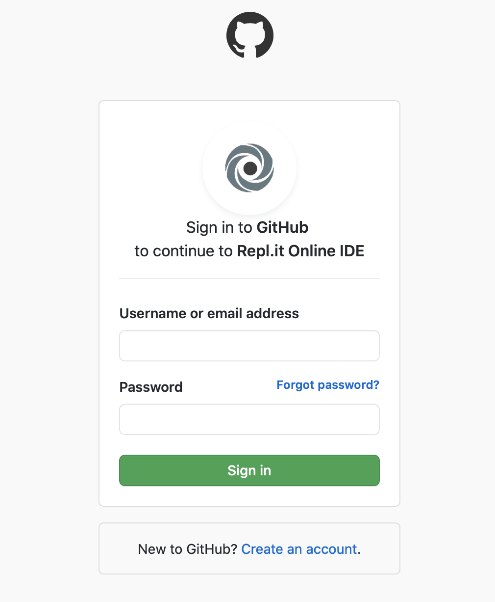

# assignment-0-repo
This is the repository for the dummy individual assignment. The purpose of this assignment is for you to set up your GitHub account and join the GitHub classroom for this course. Additionally you are also expected to familiriaze with the Pair Programming tool (repl.it) that we will use for team projects.

**GitHub** is a free-to-use project management tool between multiple collaborators. Here is a step-by-step guide to how you can complete this assignment.

## Joining Github
Please go to: https://github.com and sign up for an account using your B-mail id (as in the binghamton.edu id).

## Joining repl.it
**Repl.it** is a pair programming tool that integrates very well with GitHub. It hosts IDEs for a number of languages. You will be using this for your group assignments.\
Please go to: https://repl.it and click on the **Sign Up** tab.\
The Sign Up page provides you a variety of Sign Up option each embedded through a logo: Google, GitHub and Facebook. Please click on the GitHub logo to **Sign Up using GitHub**.\
At this point you should reach this page:\

